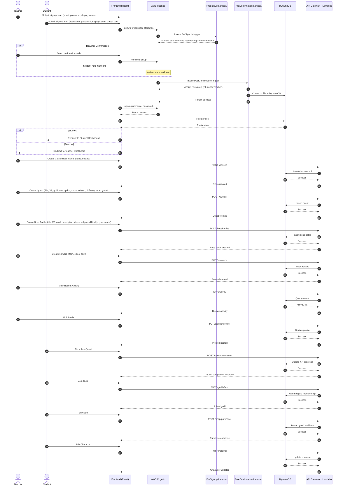

```mermaid
sequenceDiagram
    autonumber

    %% Actors
    actor Teacher
    actor Student

    %% Systems
    participant FE as Frontend (React)
    participant Cognito as AWS Cognito
    participant Pre as PreSignUp Lambda
    participant Post as PostConfirmation Lambda
    participant DB as DynamoDB
    participant API as API Gateway + Lambdas

    %% SIGNUP (Teacher + Student)
    Teacher->>FE: Submit signup form (email, password, displayName)
    Student->>FE: Submit signup form (username, password, displayName, classCode)

    FE->>Cognito: signUp(credentials, attributes)

    Cognito->>Pre: Invoke PreSignUp trigger
    Pre-->>Cognito: Student auto-confirm / Teacher require confirmation

    alt Teacher Confirmation
        Teacher->>FE: Enter confirmation code
        FE->>Cognito: confirmSignUp
    else Student Auto-Confirm
        Note over Cognito: Student auto-confirmed
    end

    Cognito->>Post: Invoke PostConfirmation trigger
    Post->>Cognito: Assign role group (Student / Teacher)
    Post->>DB: Create profile in DynamoDB
    Post-->>Cognito: Return success

    %% LOGIN
    FE->>Cognito: signIn(username, password)
    Cognito-->>FE: Return tokens
    FE->>DB: Fetch profile
    DB-->>FE: Profile data

    alt Student
        FE->>Student: Redirect to Student Dashboard
    else Teacher
        FE->>Teacher: Redirect to Teacher Dashboard
    end

    %% TEACHER ACTIONS

    %% Create Class
    Teacher->>FE: Create Class (class name, grade, subject)
    FE->>API: POST /classes
    API->>DB: Insert class record
    DB-->>API: Success
    API-->>FE: Class created

    %% Create Quest
    Teacher->>FE: Create Quest (title, XP, gold, description, class, subject, difficulty, type, grade)
    FE->>API: POST /quests
    API->>DB: Insert quest
    DB-->>API: Success
    API-->>FE: Quest created

    %% Create Boss Battle
    Teacher->>FE: Create Boss Battle (title, XP, gold, description, class, subject, difficulty, type, grade)
    FE->>API: POST /bossBattles
    API->>DB: Insert boss battle
    DB-->>API: Success
    API-->>FE: Boss battle created

    %% Create Reward
    Teacher->>FE: Create Reward (item, class, cost)
    FE->>API: POST /rewards
    API->>DB: Insert reward
    DB-->>API: Success
    API-->>FE: Reward created

    %% View Recent Activity
    Teacher->>FE: View Recent Activity
    FE->>API: GET /activity
    API->>DB: Query events
    DB-->>API: Activity list
    API-->>FE: Display activity

    %% Edit Profile
    Teacher->>FE: Edit Profile
    FE->>API: PUT /teacher/profile
    API->>DB: Update profile
    DB-->>API: Success
    API-->>FE: Profile updated

    %% STUDENT ACTIONS

    %% Complete Quest
    Student->>FE: Complete Quest
    FE->>API: POST /quests/complete
    API->>DB: Update XP, progress
    DB-->>API: Success
    API-->>FE: Quest completion recorded

    %% Join Guild
    Student->>FE: Join Guild
    FE->>API: POST /guilds/join
    API->>DB: Update guild membership
    DB-->>API: Success
    API-->>FE: Joined guild

    %% Buy Item from Shop
    Student->>FE: Buy Item
    FE->>API: POST /shop/purchase
    API->>DB: Deduct gold, add item
    DB-->>API: Success
    API-->>FE: Purchase complete

    %% View/Edit Character
    Student->>FE: Edit Character
    FE->>API: PUT /character
    API->>DB: Update character
    DB-->>API: Success
    API-->>FE: Character updated
```