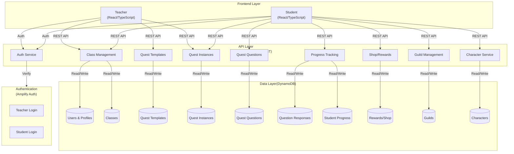

```mermaid
graph TB

    classDef spacer fill:none,stroke:none,height:1px;

    subgraph Frontend["Frontend Layer<br/>"]
        
        TeacherUI["Teacher <br/>(React/TypeScript)"]
        StudentUI["Student <br/>(React/TypeScript)"]
    end

    subgraph API["API Layer<br/>(AWS Lambda + SST)<br/>"]
        
        AuthAPI["Auth Service"]
        ClassAPI["Class Management"]
        QuestAPI["Quest Templates"]
        InstanceAPI["Quest Instances"]
        QuestionAPI["Quest Questions"]
        ProgressAPI["Progress Tracking"]
        ShopAPI["Shop/Rewards"]
        GuildAPI["Guild Management"]
        CharAPI["Character Service"]
    end

    subgraph Database["Data Layer(DynamoDB)"]
        UsersDB[("Users & Profiles")]
        ClassesDB[("Classes")]
        TemplatesDB[("Quest Templates")]
        InstancesDB[("Quest Instances")]
        QuestionsDB[("Quest Questions")]
        ResponsesDB[("Question Responses")]
        ProgressDB[("Student Progress")]
        RewardsDB[("Rewards/Shop")]
        GuildsDB[("Guilds")]
        CharDB[("Characters")]
    end

    subgraph Auth["Authentication<br/>(Amplify Auth)<br/>"]
        authSpace[" "]:::spacer
        TeacherAuth["Teacher Login"]
        StudentAuth["Student Login"]
    end

    TeacherUI -->|REST API| ClassAPI
    TeacherUI -->|REST API| QuestAPI
    TeacherUI -->|REST API| InstanceAPI
    TeacherUI -->|Auth| AuthAPI

    StudentUI -->|REST API| ClassAPI
    StudentUI -->|REST API| InstanceAPI
    StudentUI -->|REST API| QuestionAPI
    StudentUI -->|REST API| ProgressAPI
    StudentUI -->|REST API| ShopAPI
    StudentUI -->|REST API| GuildAPI
    StudentUI -->|REST API| CharAPI
    StudentUI -->|Auth| AuthAPI

    AuthAPI -->|Verify| Auth
    ClassAPI -->|Read/Write| ClassesDB
    ClassAPI -->|Read/Write| UsersDB
    QuestAPI -->|Read/Write| TemplatesDB
    InstanceAPI -->|Read/Write| InstancesDB
    QuestionAPI -->|Read/Write| QuestionsDB
    ProgressAPI -->|Read/Write| ResponsesDB
    ProgressAPI -->|Read/Write| ProgressDB
    ShopAPI -->|Read/Write| RewardsDB
    GuildAPI -->|Read/Write| GuildsDB
    CharAPI -->|Read/Write| CharDB
```