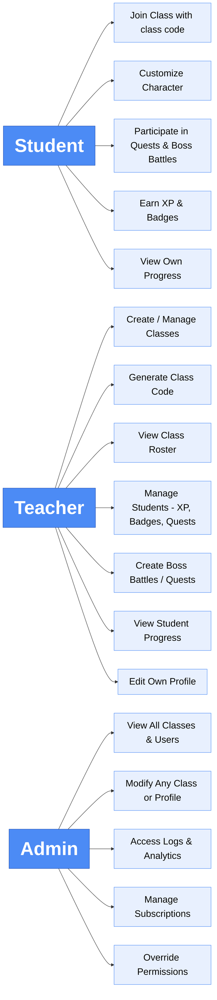

**Role Based Access Control Chart**

**Roles**
| Role | Description |
| ----------- | ----------- |
| Student | Join class using teachers class code to participate in quests and boss battles |
| Teacher | Create classes, generate class codes, and manage students |
| Admin | Internal system administrators for debugging, moderation, or support |

**Permissions Table**
| Action | Student | Teacher | Admin |
| ----------- | ----------- | ----------- | ----------- |
| Sign up | :heavy_check_mark: | :heavy_check_mark: | :heavy_check_mark: |
| Log in | :heavy_check_mark: | :heavy_check_mark: | :heavy_check_mark: |
| Join Class | :heavy_check_mark: | :heavy_multiplication_x: | :heavy_multiplication_x: |
| View Profile | :heavy_check_mark: | :heavy_check_mark: | :heavy_multiplication_x: |
| Edit Own Profile | :heavy_multiplication_x: | :heavy_check_mark: | :heavy_check_mark: |
| Create/Delete class | :heavy_multiplication_x: | :heavy_check_mark: | :heavy_check_mark: |
| Generate Class Code | :heavy_multiplication_x: | :heavy_check_mark: | :heavy_multiplication_x: |
| View student list | :heavy_multiplication_x: | :heavy_check_mark: | :heavy_check_mark: |
| Manage students | :heavy_multiplication_x: | :heavy_check_mark: | :heavy_check_mark: |
| Access admin panel | :heavy_multiplication_x: | :heavy_multiplication_x: | :heavy_check_mark: |
| Manage application data | :heavy_multiplication_x: | :heavy_multiplication_x: | :heavy_check_mark: |
