# ClassQuest User Guide

### Getting Started

1. [Teacher: Create a ClassQuest account](#teacher-creating-an-account)
2. [Student: Create a ClassQuest account](#student-creating-an-account)
3. [Teacher: Managing classes](#teacher-managing-classes)
4. [Teacher: Quest management](#teacher-quest-management)
5. [Teacher: Activity log](#teacher-activity-log)
6. [Teacher: Guild Management](#teacher-guild-management)
7. [Student: Navigation tabs](#student-navigation-tabs)
8. [Student: Guilds & Boss Battles](#student-guilds-and-boss-battles)
9. [Student: Leaderboard & Shop](#student-leaderboard-and-shop)
10. [ClassQuest Tutorial](#classquest-tutorial)
11. [ClassQuest tutorial Document](https://github.com/ClassQuest-Capstone/ClassQuest/blob/main/Project%20Management%20Documents/Tutorials%20and%20User%20guide/TutorialDoc.md)

### Teacher Creating an account

To create a ClassQuest account as a teacher, follow these steps:

1. **Navigate to the ClassQuest.com website**
    - Click on the **Register** button
    - Select **Teacher** as the account type

2. **Fill out the registration form**
    - Enter your name
    - Enter your email 
    - Select your school
    - Create a secure password
    - Click the **Sign Up** button

3. **Verify your email address**
    - Check your email for a confrimtion code
    - Copy the confirmation code 
    - Enter the confirmation code in the input field
    - Click the **Confirm Teacher Account** button

4. **Access your teacher dashboard**
    - You will be redirected to the teacher dashboard with a tutorial to help you get started

### Student Creating an account

To create a ClassQuest account as a student, follow these steps:

1. **Navigate to the ClassQuest.com website**
    - Click on the "Register" button
    - Select **Student** as the account type

2. **Fill out the registration form**
    - Enter the class code provided by your teacher
    - Enter your username
    - Enter your Display Name
    - Create a secure password
    - Click the **Sign Up** button

3. **Login to your account**
    - Enter your username and password
    - Click the **Sign In** button

4. **Access your student dashboard**
    - You will be redirected to the student dashboard with a tutorial to help you get started

### Teacher: Managing classes

Teachers can create and manage classes on ClassQuest. You can invite students to join a class with a class code, monitor assigned quests and boss battles, and track student progress.

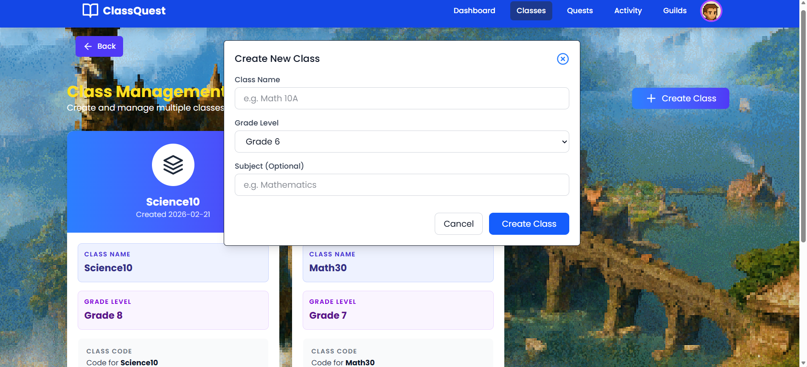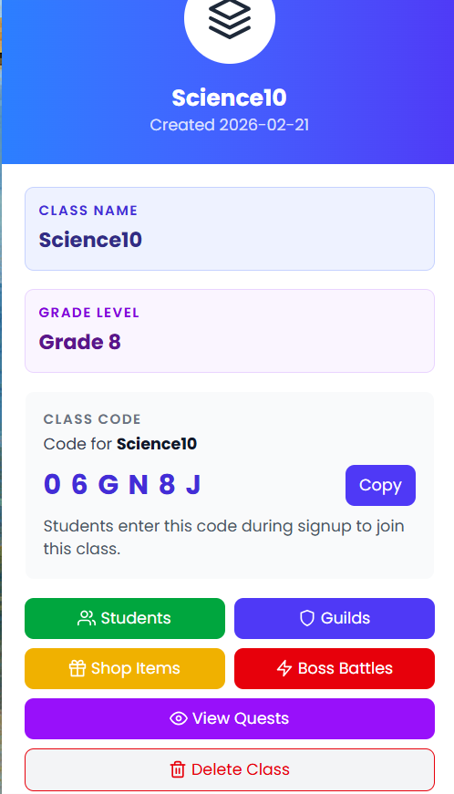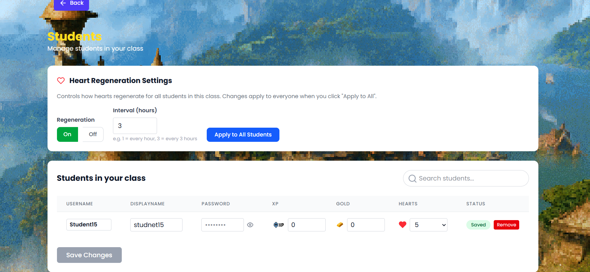

1. **Create a class**
    - Click the **Create Class** button
    - Enter a class name
    - Select grade level
    - Enter a subject (optional)
    - Click the **Create Class** button in the modal

2. **Manage students**
    - Click the **Students** button
    - Adjust fields for each student as required
    - Click the **Save Changes** button

  Here you can change student username and display name, increase or decrease their XP, gold & hearts, and remove a student from a class. You can also adjust the heart regeneration logic as required.

3. **ManageGuilds and Shop**
    - Click the **Guilds** button to create guilds per class, assign students to guilds and view current guilds 
    - Click the **Shop** button to create items in the shop and make them available to students to purchase 

4. **Manage quests and boss battles**
    - Click the **View Quests** button to view assigned quests
    - Click the **Boss Battles** button to view active boss battles

### Teacher: Quest management

Quests and boss battles can be created and managed in the quest management section. Teachers can also assign quests and boss battles to classes in this section.

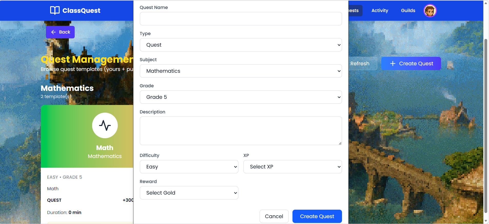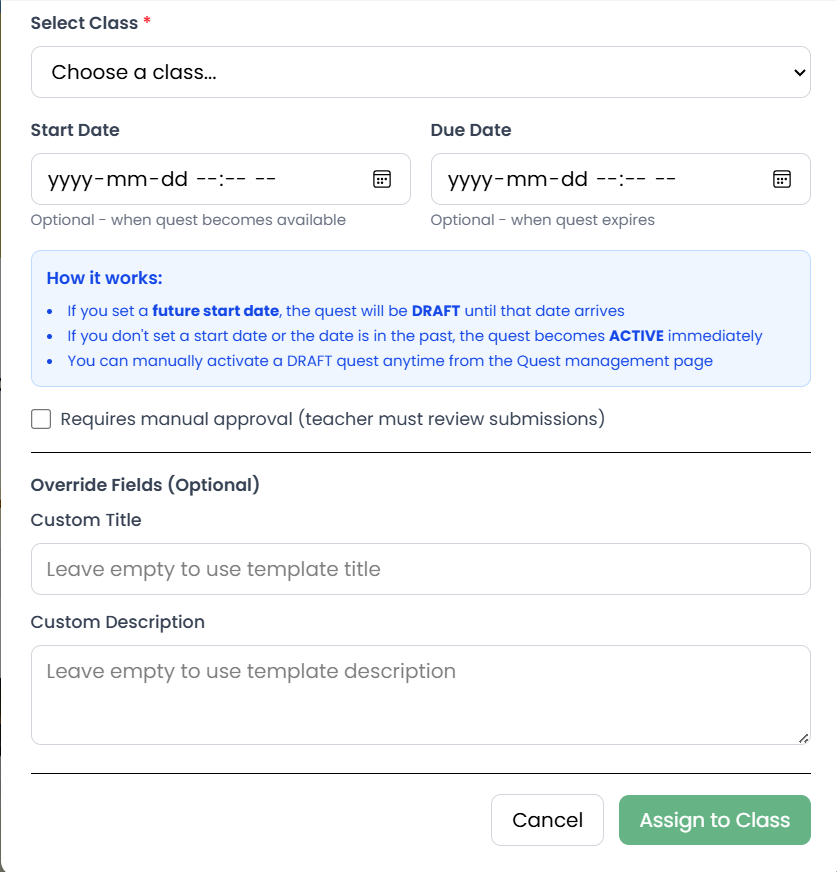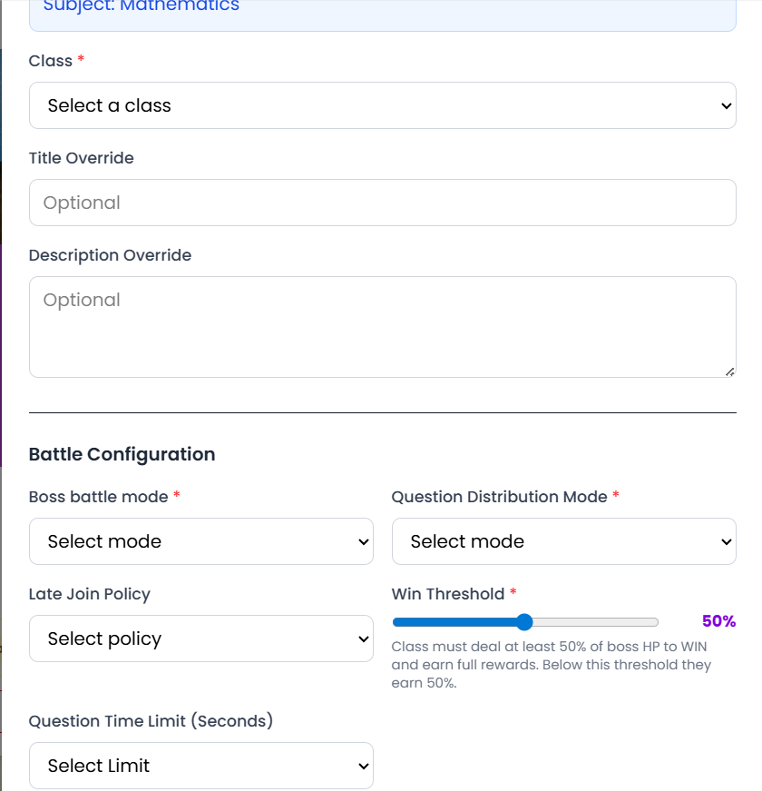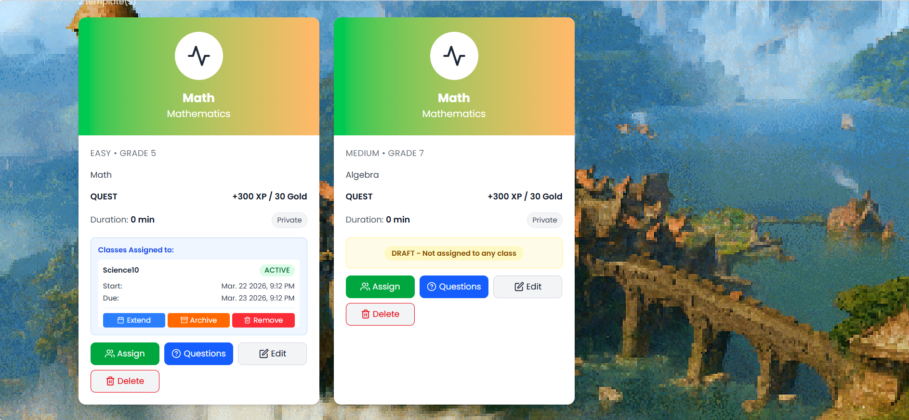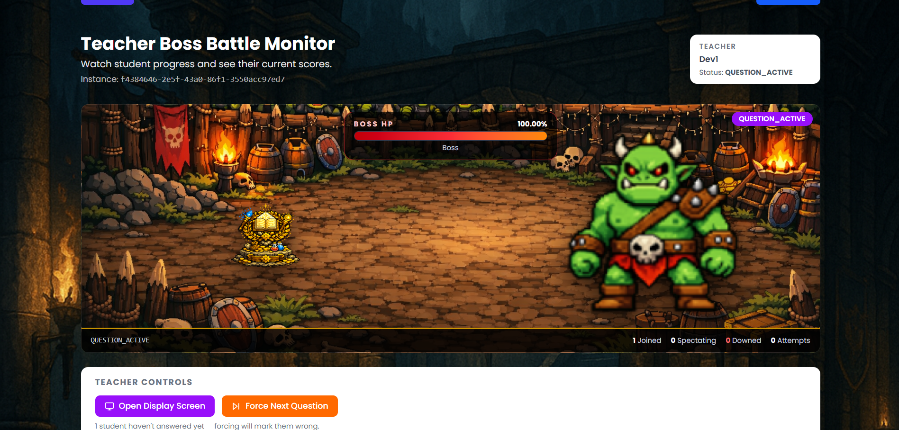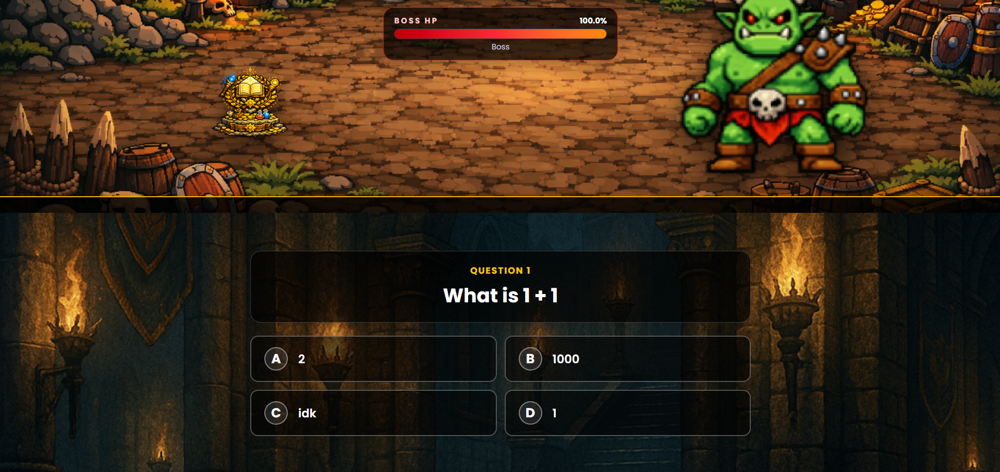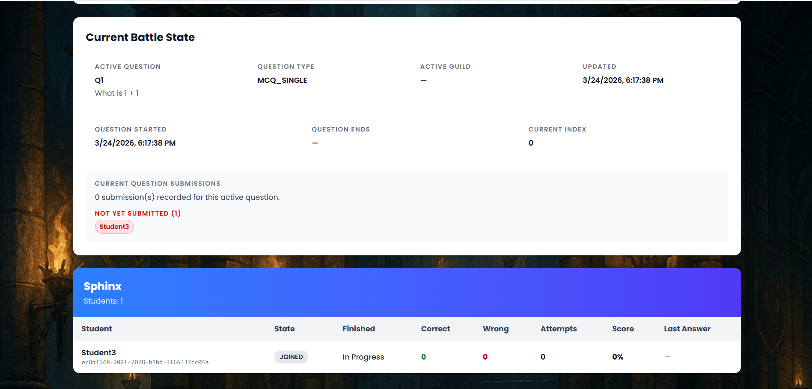

To create a quest or boss battle and assign it to a class, follow these steps:

1. **Create Quest/Boss Battle template**
    - Click the **Create Quest** button
    - Enter a name for the quest or boss battle
    - Select the type of quest or boss battle
    - Select the subject for the quest or boss battle
    - Select the grade level
    - Provide a description for the quest or boss battle
    - Select the difficulty
    - Select the base XP (Experience Points) reward for the quest or boss battle
    - Select the gold reward
    - Click the **Create Quest button** on the modal to create the template

2. **Assign Quest to a class**
    - On the quest template click the **Assign** button
    - Select the class to assign quest to
    - Select the start and due dates
    - Click the **Assign to Class** button on the modal to assign the quest to the class

3. **Assign Boss Battle to a class**
    - On the boss battle template click the **Assign** button
    - Select the class to assign boss battle to
    - Select Boss Battle mode
    - Select question distribution mode
    - Configure the win treshold
    - Select late join policy if applicable
    - click the **Assign** button on the modal to assign the boss battle to the class

4. **Launcing Boss Battles**
    - Click the **Open Lobby** button on the boss battle template in class
    - Once all avaliable students have joined, start the countdown to begin boss battle
    - During the boss battle, use the **Qpen Display Screen** to display live questions to students
    - Click the **Force Next Question** button to advance to the next question
    - Once battle is completed, use the **Back** button to return to boss battle section under class 

5. **Editing quests and boss battles**
    - Click the **Questions** button on the quest or boss battle template to edit created questions or add new questions
    - Click the **Edit Quest Questions** button on the opened modal to edit Quest questions

6. **Deleting quests and boss battles**
    - Click the **Delete** button on the quest or boss battle template to delete the template

### Teacher: Activity Log
To view the activity log and Leaderboard across all classes, follow these steps:
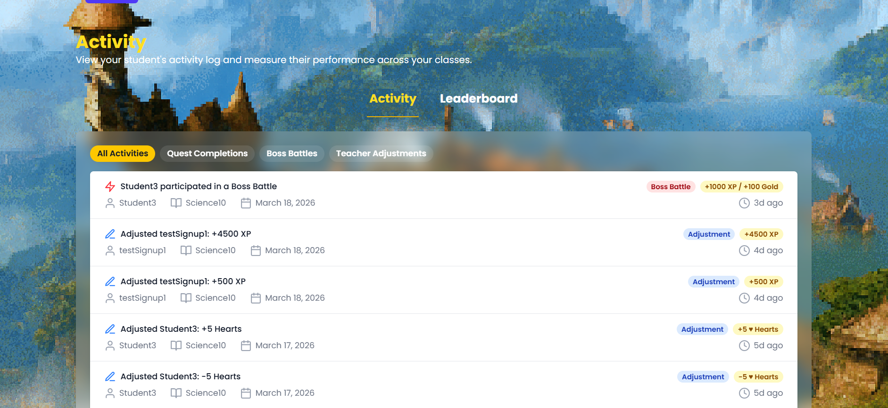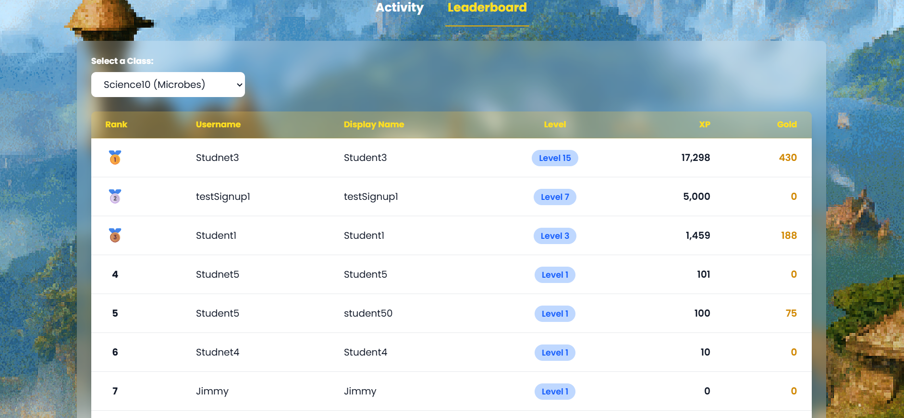

1. **Recent Activity**
    - Click the **Activity** tab to view class Activity Log
    - Use the **Quest completions** filter to view all completed quests
    - Use the **Boss battle** filter to view all boss battle participations
    - Use the **Teacher adjustment** filter to view all teacher adjustments

2. **Leaderboard**
    - Click the **Leaderboard** tab to view all students placement on the leaderboard for the class
    - Use the **Select a class** filter to view all leaderboard entries for the class

### Teacher: Guild Management

Guilds can be created for a class and managed in the guild management section. Teachers can also assign students to guilds in this section.

To create a guild for a class and assign students to guilds, follow these steps:

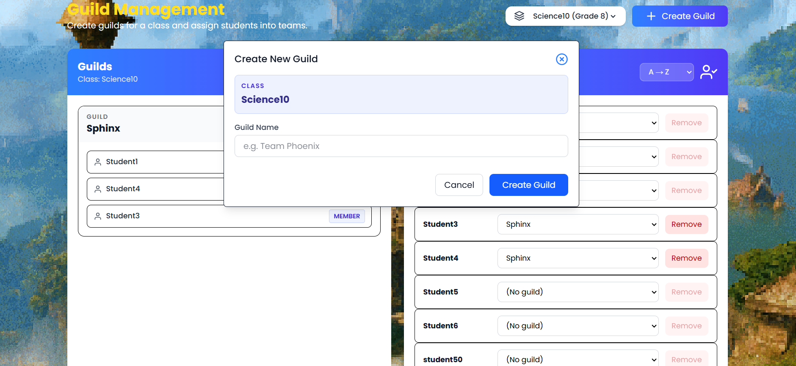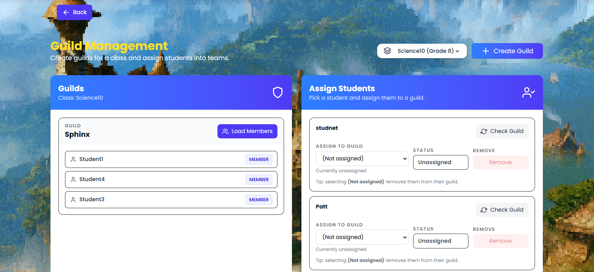

1. **Create Guild**
    - Select the class you want to create a guild for
    - Click the **Create Guild** button
    - Enter a name for the guild
    - Click the **Create Guild** button on the modal to create the guild

2. **Assign Students to Guilds**
    - On the right side of the screen, it shows all students in the selected class
    - Using the dropdown, select the guild you want to assign the student to this would automatically add the student to the guild
    - Use the **Remove button** to remove the student from assigned guild
    - Use the sort button to sort student list alphabetically or by guild

### Student: Navigation tabs

Here students can view/ complete assigned quests, claim rewards and view their current hearts.

To do the above,follow these steps:

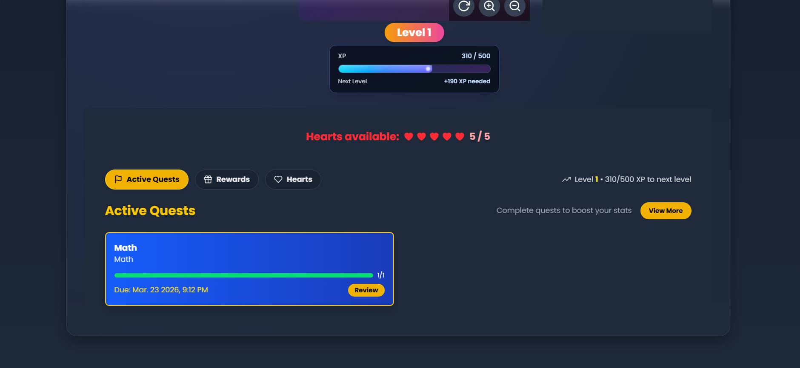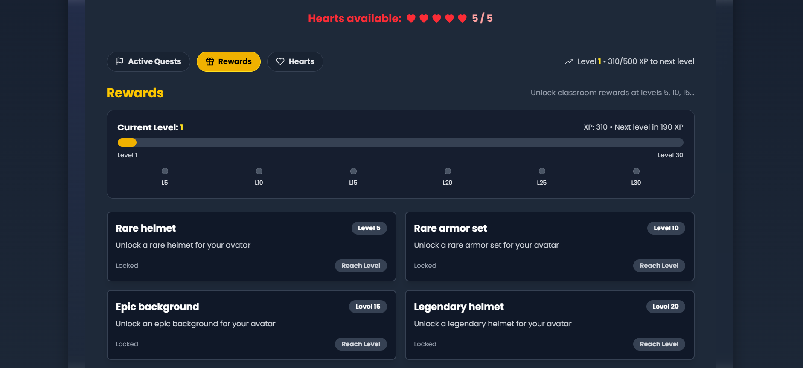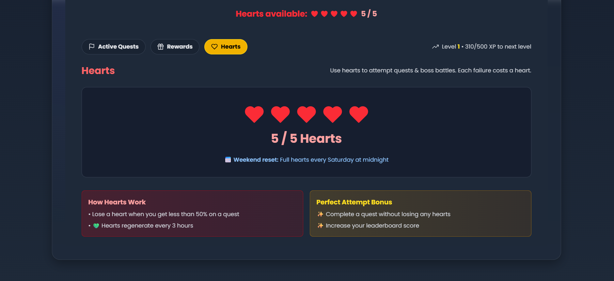

1. **View Active Quests**
    - Click the **Active Quests** tab to view active quests
    - Click the **Start Quest** button to start a quest
    - Use the **View more** button to view more quests grouped by subject
    - Once a quest is completed, you can review it using the **review** button

    if a quest is past its due date, it will not be visible on the student dashboard

2. **Claim rewards**
    - Click the **Rewards** tab to view available rewards
    - Click the **Claim** button to claim a reward once you reach required level
    - Once claimed reward will be visible in your inventory

3. **View Hearts**
    - Click the **Hearts** tab to view your current hearts
    - Here you get basic information about your hearts and their regeneration logic

### Student: Guilds and Boss Battles

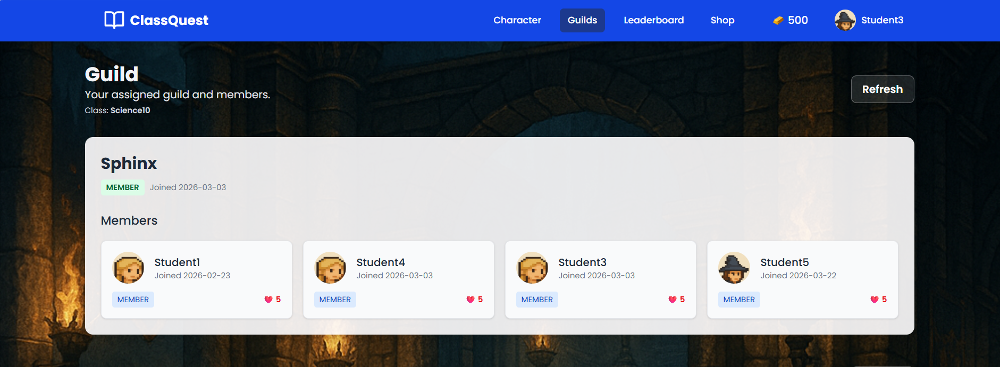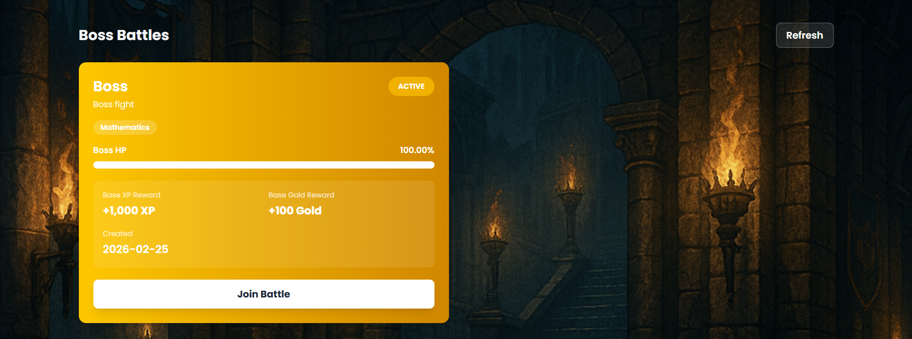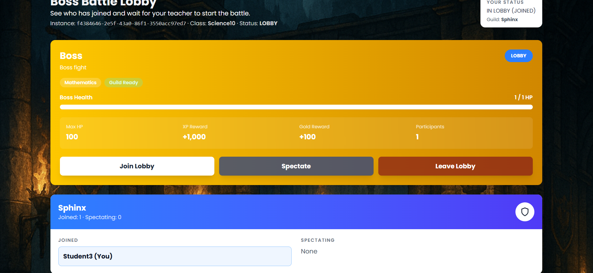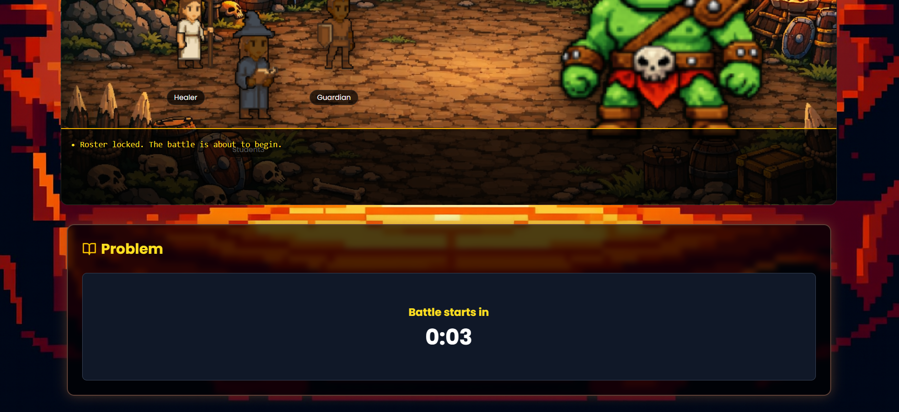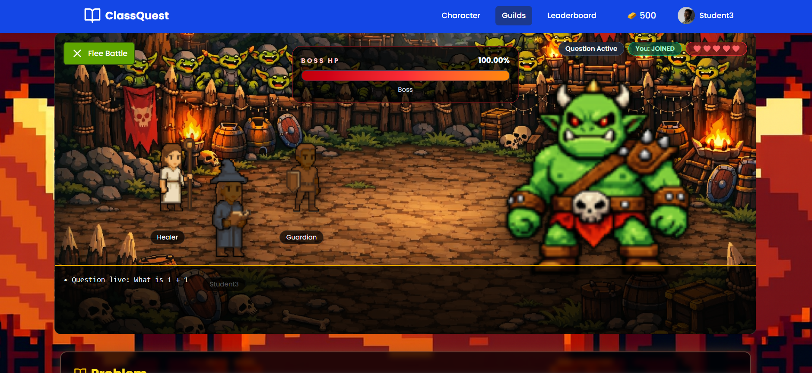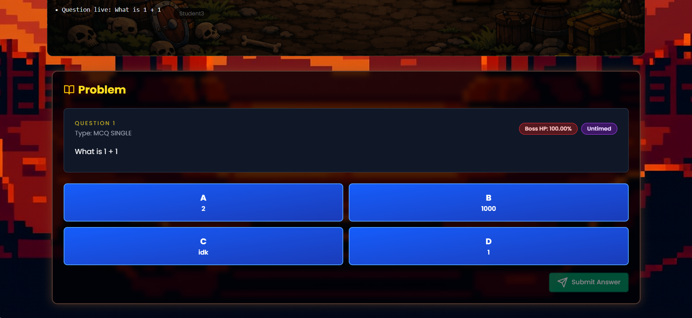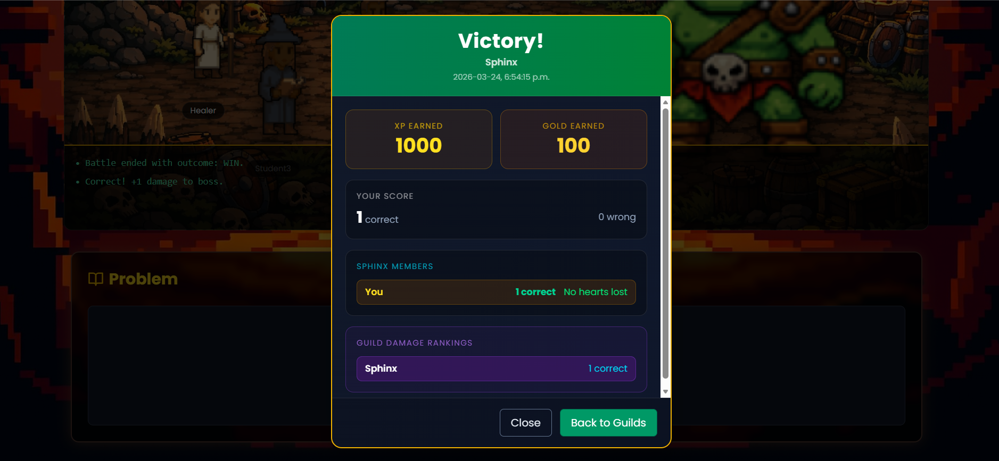

Once assigned to a guild, navigate to the **Guilds** page to view your guild, guild memebers and their current hearts.

To participate in a boss battle follow these steps:

1. Navigate to the **Boss Battles** section and click **Join Battle** button to participate
2. Once joined, you will be redirected to the battle lobby
3. When in the lobby wait for the teacher to start the battle
4. Once the teacher starts the battle, you will be redirected to the boss fight countdown
5. Select and submit the correct answer to each question to deal damage to the boss
6. Once the boss is defeated, you will be redirected to the boss battle results page
7. Here you can view your reward and your ranking for the class
8. Click the **Back to Guilds** button to return to guilds section

### Student: Leaderboard and Shop

To view the Leaderboard and Shop, follow these steps:

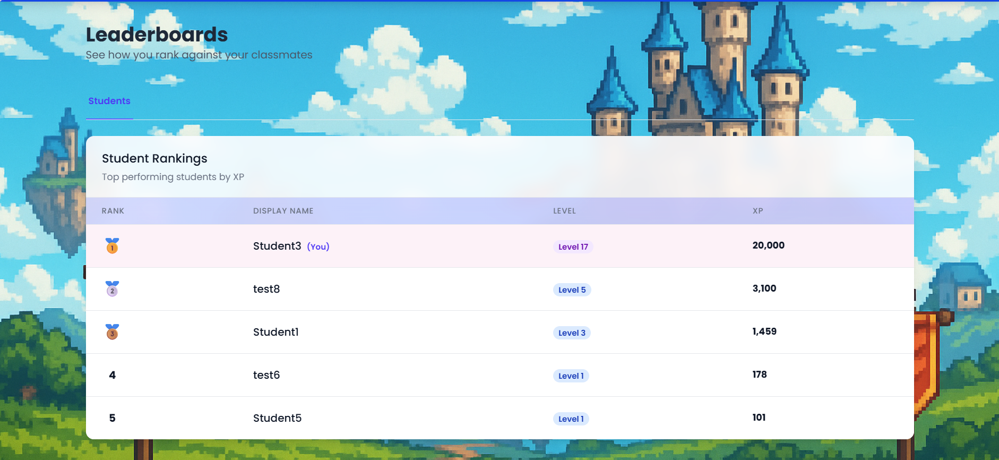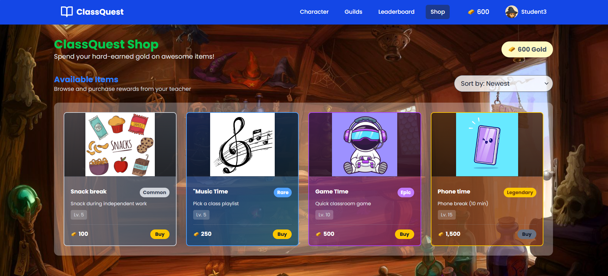

1. **Leaderboard**
    - Click the **Leaderboard** tab to view all students placement on the leaderboard for the class
    - Here the students can view the top 5 students and their placement on the leaderboard for their class

2. **Shop**
    - Click the **Shop** tab to view available rewards
    - Here the students can view Items and buy them from the shop if they have achived the level required to buy the item

### ClassQuest Tutorial

The ClassQuest tutorial provides a step-by-step guide to help you get started with the platform. It covers the basics of creating and managing classes, quests, boss battles, and rewards.

1. **Teacher tutorial**
    1.1. Create a ClassQuest account as a teacher
    1.2. Create a class
    1.3. Manage students