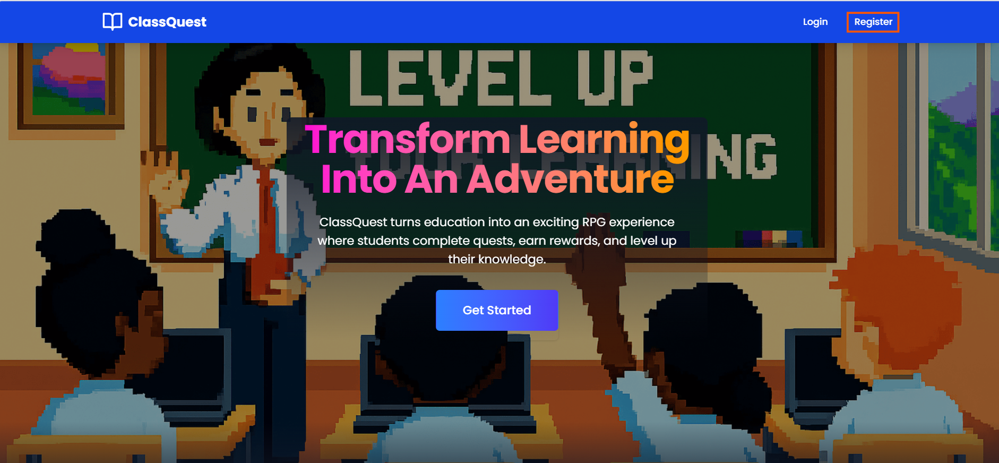
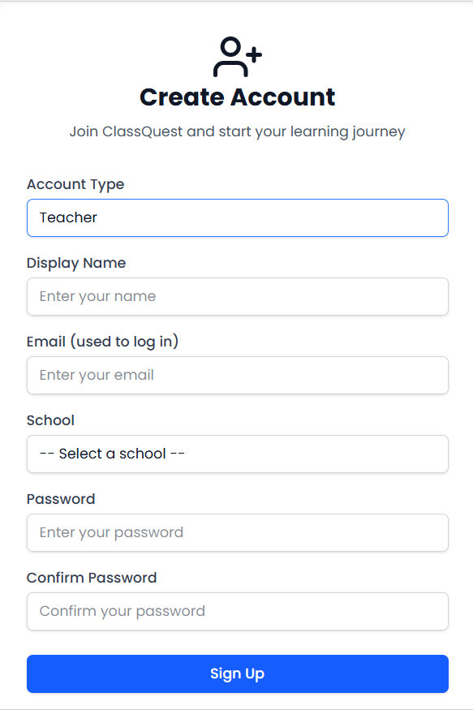
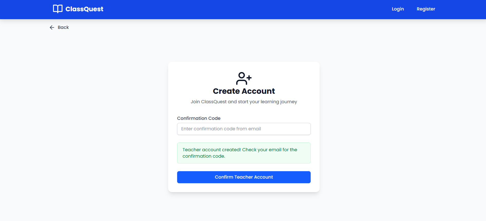
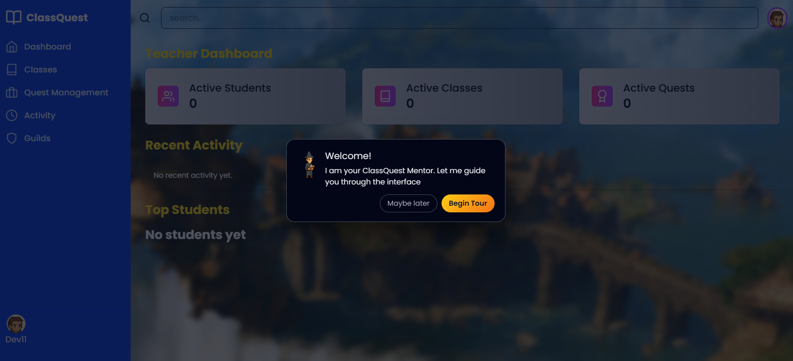
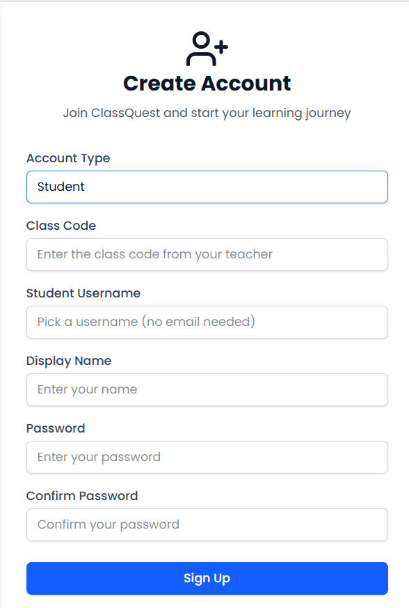
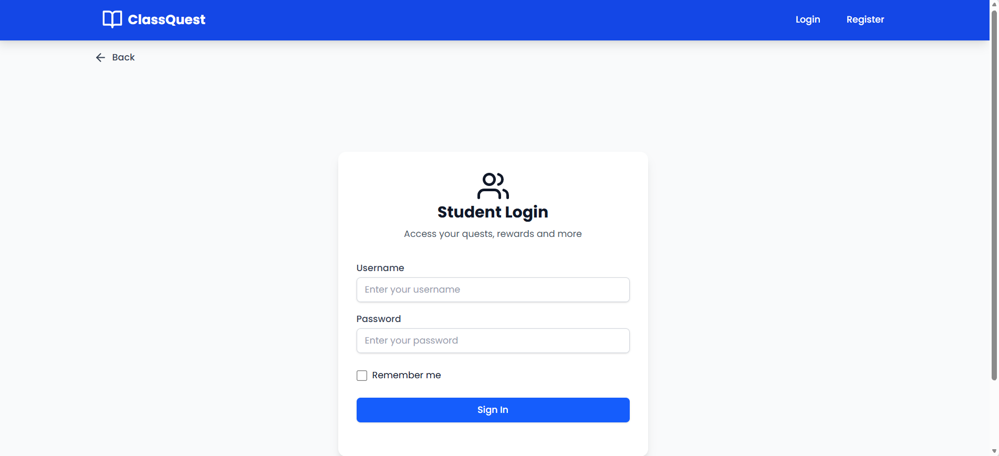
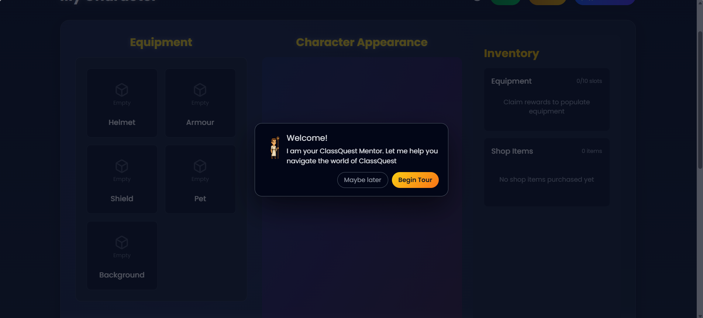

# ClassQuest User Guide

### Getting Started

1. [Create a ClassQuest account]()
2. [Overview of ClassQuest features]()
3. [Using ClassQuest as a teacher]()
4. [Using ClassQuest as a student]()
5. [ClassQuest tutorial](https://github.com/ClassQuest-Capstone/ClassQuest/blob/main/Project%20Management%20Documents/Tutorials%20and%20User%20guide/TutorialDoc.md)

### Teacher Creating an account

To create a ClassQuest account as a teacher, follow these steps:

1. **Navigate to the ClassQuest.com website**
    - Click on the "Register" button
    - Select "Teacher" as the account type

2. **Fill out the registration form**
    - Enter your name
    - Enter your email 
    - Select your school
    - Create a secure password
    - Click the "Sign Up" button

3. **Verify your email address**
    - Check your email for a confrimtion code
    - Copy the confirmation code 
    - Enter the confirmation code in the input field
    - Click the "Confirm Teacher Account" button

4. **Access your teacher dashboard**
    - You will be redirected to the teacher dashboard with a tutorial to help you get started

### Student Creating an account

To create a ClassQuest account as a student, follow these steps:

1. **Navigate to the ClassQuest.com website**
    - Click on the "Register" button
    - Select "Student" as the account type

2. **Fill out the registration form**
    - Enter the class code provided by your teacher
    - Enter your username
    - Enter your Display Name
    - Create a secure password
    - Click the "Sign Up" button

3. **Login to your account**
    - Enter your username and password
    - Click the "Sign In" button

4. **Access your student dashboard**
    - You will be redirected to the student dashboard with a tutorial to help you get started